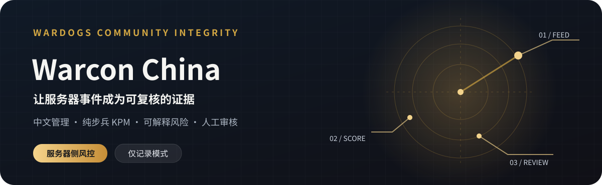
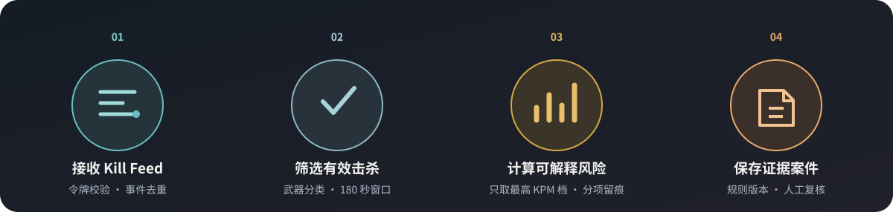

  

# Warcon China rabot -wardogs

**面向 WARDOGS 社区服务器的中文管理面板与行为风控扩展。** 本项目基于开源 [Warcon](https://github.com/warcon-app/warcon)，沿用其 RCON 客户端、服务器管理、Kill Feed、组织权限和审计能力，在服务端增加可解释的玩家行为分析。这里的“风控”指辅助管理员发现异常和保存证据，不是客户端反作弊，也不读取玩家设备。

> **默认仅记录与人工审核。** 组织所有者可以在“组织 → 社区风控”逐项确认开启实验性自动踢出、24 小时或 7 天临时隔离。自动执行受实时行为证据、在线状态、冷却和熔断限制；不会自动永久封禁。Warcon 原有的入服账号风险自动化是独立功能。

[中文使用说明](README.zh-CN.md) · [技术架构与规则](docs/architecture.zh-CN.md) · [功能完成情况](docs/integrity-system.md) · [实施计划](docs/wardogs-community-integrity-plan.zh-CN.md) · [上游完整说明](README.upstream.md)

## 从事件到证据

  

服务器上报的击杀事件先经过身份、阵营、武器分类与重复事件检查。只有有效的纯步兵击杀进入滚动 180 秒窗口。KPM、爆头率、穿透率、游戏时钟短时爆发均可独立触发行为发现；独立受害者、独立举报人、有效的 Steam 封禁记录和近期历史风险参与解释评分。达到案件门槛时保存事件与规则版本，供管理员复核。未知武器、载具、迫击炮、队友击杀等不会抬高纯步兵指标。

## 你现在可以做什么

| 功能                                                     | 当前状态                                              |
| -------------------------------------------------------- | ----------------------------------------------------- |
| 多服务器 RCON 管理、组织权限、审计、玩家档案             | 可用，继承自 Warcon                                   |
| SteamID64 档案、历史昵称、在线击杀/死亡/KD               | 可用；昵称不作身份主键                                |
| 180 秒纯步兵 KPM、近 10 分钟峰值、独立异常窗口           | 可用；无可靠 Feed 时隐藏或降级                        |
| 爆头率、穿透率、短时爆发、Steam 封禁历史、重复 KO        | 可用；只在行为发现后读取 Steam，缺失或过期按未知处理  |
| 可调 KPM 分段、风险权重、风险阈值、武器分类              | 组织所有者可在“组织 → 社区风控”调整；保存有版本与审计 |
| 风险分、分项解释、证据案件、24 小时/72 小时/7 天影响预览 | 可用，属于模拟运行和人工审核                          |
| 网页举报、可选 Discord 案件提醒                          | 可用；举报需登录并绑定 Steam，提醒不公开举报人        |
| 实验性自动踢出、24 小时或 7 天临时隔离                   | 可由组织所有者逐项开启；默认全关，不执行永久自动封禁  |
| 游戏内 `!report`/`!BAN`                                  | 未接入；当前没有已验证的游戏聊天接收接口              |

## KPM 分段如何计分

纯步兵 KPM = 最近 180 秒有效纯步兵击杀数 ÷ 3。默认小于 4.00 视为正常 KPM；达到门槛只是一项行为风险信号，不能单独认定作弊。每次**只取命中的最高一档**，不会把各档加分累加。

| 180 秒纯步兵 KPM | 默认加分 |
| ---------------- | -------: |
| 低于 4.00        |        0 |
| 4.00 至低于 4.50 |      +18 |
| 4.50 至低于 5.00 |      +24 |
| 5.00 至低于 6.00 |      +32 |
| 6.00 至低于 8.00 |      +42 |
| 8.00 及以上      |      +52 |

KD 会在玩家档案中显示供参考，**不单独加风险分**。分段和权重均可由组织所有者修改；更多边界条件见[技术文档](docs/architecture.zh-CN.md)。

## 没有游戏服务器，也能预览

完成首次设置并登录后，先创建组织，再到“服务器 → 添加服务器”填写：名称任意、主机地址 `demo`、端口 `1`、协议 `http`、RCON 密码 `demo`。这会连接内置模拟游戏服务器，不需要真实的 WARDOGS 实例。主机和密码必须输入英文 `demo`。

## 部署

本项目使用 Bun、SvelteKit、PostgreSQL/TimescaleDB 和 Docker Compose。运行 `migrate`、网页、Worker 与数据库四个服务；浏览器不会直接连接游戏 RCON。

1. 复制 `.env.example` 为 `.env`，设置不同的随机 `BETTER_AUTH_SECRET`、`ENCRYPTION_KEY`、`RELAY_SECRET`，以及 `POSTGRES_PASSWORD` 和实际访问地址 `ORIGIN`。
2. 执行 `docker compose up -d --build`。
3. 打开 `ORIGIN` 完成所有者初始化；可先添加上述演示服务器。

请勿提交 `.env`。详细的反向代理、备份、游戏服接入和本地开发步骤，见[上游完整说明](README.upstream.md)与[入门文档](docs/getting-started.md)。

## 技术与来源

项目以 [Warcon](https://github.com/warcon-app/warcon) 为基础，保留上游的协议实现和 MIT 许可，WARDOGS RCON 边界见[现有 API 研究文档](docs/wardogs-api.md)。本仓库的中文说明和社区风控扩展用于服务器侧管理，不代表 WARDOGS、BULKHEAD 或 Team17 官方产品。
