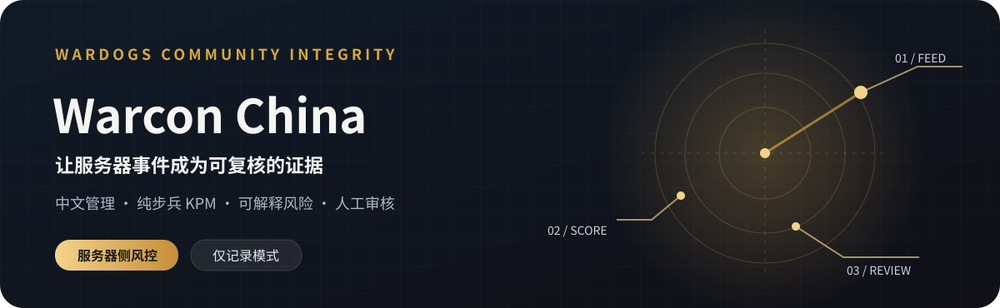
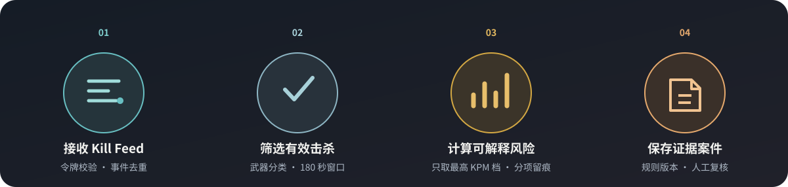

  

# Warcon China rabot -wardogs

**面向 WARDOGS 社区服务器的中文管理面板与行为风控扩展。** 本项目基于开源 [Warcon](https://github.com/warcon-app/warcon)，沿用其 RCON 客户端、服务器管理、Kill Feed、组织权限和审计能力，在服务端增加可解释的玩家行为分析。这里的“风控”指辅助管理员发现异常和保存证据，不是客户端反作弊，也不读取玩家设备。

> **默认仅记录与人工审核。** Legacy 模式保留组织所有者逐项确认的实验性动作开关；统计委员会须显式开启自动踢出；仅KPM＞4且另一专家至少可疑才可直接踢出，普通投票只建待审核案件。不会自动永久封禁。Warcon 原有的入服账号风险自动化是独立功能。

[从零安装：一步一步操作](docs/install.zh-CN.md) · [中文使用说明](README.zh-CN.md) · [案件审核与七天封禁](docs/case-review-penalty.zh-CN.md) · [自动强弱阵营平衡](docs/skill-balance.zh-CN.md) · [硬性数值限制](docs/numeric-limits.zh-CN.md) · [五专家委员会规则（v3）](docs/committee-v3.zh-CN.md) · [技术架构与规则](docs/architecture.zh-CN.md) · [完整功能介绍](docs/features.zh-CN.md) · [AI 辅审](docs/integrity-ai.zh-CN.md) · [历史导入](docs/integrity-import.zh-CN.md) · [组队控制](docs/group-control.zh-CN.md) · [赛后荣誉公告](docs/match-awards.zh-CN.md) · [上游完整说明](README.upstream.md)

## 从事件到证据

  

服务器上报的击杀事件先经过身份、阵营、武器分类与重复事件检查。只有有效的纯步兵击杀进入滚动 180 秒窗口。KPM、爆头率、穿透率、游戏时钟短时爆发均可独立触发行为发现；独立受害者、独立举报人、有效的 Steam 封禁记录和近期历史风险参与解释评分。达到案件门槛时保存事件与规则版本，供管理员复核。未知武器、载具、迫击炮、队友击杀等不会抬高纯步兵指标。

## 你现在可以做什么

| 功能 | 当前能力 |
| --- | --- |
| 中文 RCON 管理 | 多服务器、组织权限、审计、玩家、地图、封禁与公开状态页 |
| 玩家指标与图表 | 击杀、死亡、KD、180 秒纯步兵 KPM、峰值；按武器切换的全服击杀距离分布 |
| 五专家委员会 | 击杀节奏、精准度、生涯偏差、本局变化点、持续异常；P90 可疑、P95 高度异常 |
| 证据案件与归档 | 首页最近 5 件、分页归档、冻结证据、审核和处罚记录关联 |
| AI 自动辅审 | 兼容 OpenAI 的 API；案件 JSON 输入／输出、理由与数字核对，仅建议不封禁 |
| 历史数据导入 | JSON／JSONL 模板、校验、审核与撤销；外服记录有独立来源 |
| 管理员确认违规 | 明确确认后本服封禁 7 天；证据不足不处罚 |
| 自动化规则 | 禁止换边、武器限制、死亡后强弱队平衡、KPM／KD／金钱效率上限 |
| 疑似组队识别 | 昵称前缀相似度、人数阈值、手动／自动、结构化／AI；只列名单 |
| 赛后荣誉广播 | MVP、多杀、一命连杀、赚钱、持有金钱、在线时长；每项第一，并列随机 |
| 外部资料与通知 | 可选 Steam API、网页举报、Discord 案件提醒 |

**委员会普通投票只产生观察或待审核案件。**至少 2 票可疑及以上进入观察；至少 3 票高度异常或 4 票可疑及以上生成案件。只有 **KPM 严格大于 4 + 另一独立专家至少可疑**，且组织已启用、数据和执行保护均通过，才走委员会直接踢出通道。AI 不代替管理员作处罚决定。

新安装默认统计影子模式，自动处置开关关闭。各项自动化独立设置，不能把展示阈值等同于已经启用。完整入口、默认行为、样本条件和数据限制见[功能介绍](docs/features.zh-CN.md)。

## Legacy KPM 分段如何计分

纯步兵 KPM = 最近 180 秒有效纯步兵击杀数 ÷ 3。Legacy 默认小于 4.00 不加 KPM 分；达到门槛只是一项行为风险信号，不能单独认定作弊。每次**只取命中的最高一档**，不会把各档加分累加。

| 180 秒纯步兵 KPM | 默认加分 |
| ---------------- | -------: |
| 低于 4.00        |        0 |
| 4.00 至低于 4.50 |      +18 |
| 4.50 至低于 5.00 |      +24 |
| 5.00 至低于 6.00 |      +32 |
| 6.00 至低于 8.00 |      +42 |
| 8.00 及以上      |      +52 |

KD 会在玩家档案中显示供参考，**不单独加风险分**。以上是 Legacy 分数分段，仅在 Legacy 模式可修改；统计委员会的阈值与投票规则由版本化代码控制，见[委员会文档](docs/committee-v3.zh-CN.md)。

## 没有游戏服务器，也能预览

完成首次设置并登录后，先创建组织，再到“服务器 → 添加服务器”填写：名称任意、主机地址 `demo`、端口 `1`、协议 `http`、RCON 密码 `demo`。这会连接内置模拟游戏服务器，不需要真实的 WARDOGS 实例。主机和密码必须输入英文 `demo`。

## 从零安装：先在自己的电脑上试

**新安装没有默认网页账号或密码。** 你会在首次打开 `/setup` 时亲自创建所有者账号。Docker Compose 会连同 PostgreSQL/TimescaleDB 一起启动；无需另外安装数据库或 Bun。完整的 Windows、macOS、Ubuntu 操作步骤和故障排查见[中文从零安装指南](docs/install.zh-CN.md)。最短路径如下：

1. 安装并启动 [Docker Desktop](https://docs.docker.com/desktop/)（Ubuntu 安装 Docker Engine 和 Compose 插件），安装 [Git](https://git-scm.com/downloads)。在终端确认 `docker compose version` 和 `git --version` 能显示版本。
2. 执行 `git clone https://github.com/1508425541zhang/Warcon-China-rabot-wardogs.git`，然后 `cd Warcon-China-rabot-wardogs`。
3. Windows PowerShell 执行 `Copy-Item .env.example .env`；macOS/Linux 执行 `cp .env.example .env`。打开 `.env`，分别设置四个**不同**的随机值：`BETTER_AUTH_SECRET`、`ENCRYPTION_KEY`、`RELAY_SECRET`、`POSTGRES_PASSWORD`。本机试用把 `ORIGIN` 设为 `http://localhost:3000`。生成随机值的完整命令见[第 2 步](docs/install.zh-CN.md#第-2-步复制配置模板)。
4. 执行 `docker compose config -q` 检查配置，再执行 `docker compose up -d --build`，等待首次下载和构建结束。
5. 执行 `docker compose ps -a`：`db` 应为 healthy，`warcon` 和 `worker` 应为 running，`migrate` 成功退出是正常情况。
6. 在同一台电脑打开 `http://localhost:3000/setup`，创建**自己的**用户名与网页登录密码；以后从 `/sign-in` 登录。`POSTGRES_PASSWORD` 是数据库密码，不能拿来登录网页。
7. 想先看效果，可按上文“没有游戏服务器，也能预览”添加 `demo` 模拟服务器。真实游戏服的 RCON 接入见[安装指南第 6 步](docs/install.zh-CN.md#第-6-步有游戏服后再接入)。

请勿提交 `.env`。公网访问还需要域名、HTTPS 和正确的 `ORIGIN`；安装指南也列出更新、日志、停止与忘记密码的方法。

## 技术与来源

项目以 [Warcon](https://github.com/warcon-app/warcon) 为基础，沿用上游协议实现；当前仓库许可见 [AGPL-3.0 许可证](LICENSE)，WARDOGS RCON 边界见[现有 API 研究文档](docs/wardogs-api.md)。本仓库的中文说明和社区风控扩展用于服务器侧管理，不代表 WARDOGS、BULKHEAD 或 Team17 官方产品。
