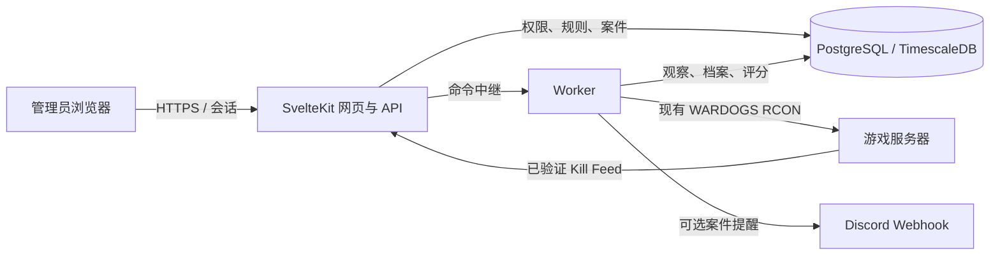

# Warcon China 技术架构与风控规则

本文对应当前仓库的**已实现代码**。规划中的自动处置、申诉和聊天命令见[实施计划](wardogs-community-integrity-plan.zh-CN.md)；上游功能和部署细节见[原版 README](../README.upstream.md)。

## 1. 系统边界

Warcon China 是基于 Warcon 的 WARDOGS 社区服务器管理项目。它复用 `src/lib/server/rcon.ts`、`transport.ts` 和 `docs/wardogs-api.md` 所描述的现有 RCON 接口，不重写协议客户端。系统只分析服务器提供的状态、会话与 Kill Feed，以及已授权获取的公开资料；不扫描客户端进程、硬件或本地文件。

当前社区风控以 `dry_run` 运行。规则接口拒绝将其改成 `enforce`；风险分和案件供管理员查看，不触发社区风控自动处罚。原 Warcon 的自动化功能有独立配置与风险来源，部署者应分开审查。

## 2. 运行架构

`docker-compose.yml` 默认启动 `migrate`、`warcon`、`worker`、`db`。迁移先执行；网页处理身份、权限和 API；Worker 负责轮询、事件观察和后台递送。数据库使用 Drizzle schema 与 `drizzle/` 迁移。浏览器不直接持有 RCON 密码，密码加密存储。

关键代码路径：

| 领域 | 主要代码 |
| --- | --- |
| RCON 与命令审计 | `src/lib/server/rcon.ts`、`transport.ts`、`rcon-run.ts`、`dispatcher.ts` |
| Worker、租约、出站队列 | `src/worker/`、`src/lib/server/leadership.ts`、`outbox.ts` |
| Kill Feed 接收与持久化 | `src/routes/api/ingest/events/+server.ts`、`src/lib/server/feed*.ts` |
| 纯步兵分类、窗口、评分、证据、举报 | `src/lib/server/integrity/` |
| 组织权限与审计 | `src/lib/server/access.ts`、`src/lib/capabilities.ts`、`audit.ts` |
| 管理页面 | `src/routes/(app)/server/[id]/integrity/` |

## 3. 从 Kill Feed 到案件

1. 接收端验证专用令牌并限制请求；事件入库后按 ID 去重。
2. 武器分类只把确认的步兵武器列为 `INFANTRY`。`UNKNOWN`、载具、迫击炮、固定武器、环境、自杀、队友击杀与阵营不明事件不进入纯步兵 KPM。
3. Worker 依据游戏事件时钟维护滚动 180 秒窗口。KPM = 有效击杀数 ÷ 3；同一窗口内还计算爆头率、穿透率和最高爆发档（3 杀/5 秒、4 杀/8 秒、5 杀/10 秒、6 杀/12 秒、8 杀/15 秒）。接收时间不用于爆发间隔。
4. KPM、爆头率、穿透率或爆发任一达到配置门槛即可产生行为发现。活动窗口仅保留一个窗口行；新原因或更高档位追加评分快照并更新事件集，相同档位不会反复写入。Steam 先验和举报不会单独构成当前行为异常。
5. 分数由当前行为、独立受害者、独立异常窗口、独立举报人、有效 Steam 封禁史与近期已保存的 KO 级别等分项形成。Steam 只在行为发现后查询；缺失或过期资料按未知处理。旧 Risk 总分不参与。KD 仅展示。
6. 达到配置的案件阈值时保存 `CASE-…`、命中事件、规则版本、行为原因及各信号快照。证据完整度按现有数据标为 B/C/D；A 等级尚需连续 Feed 验证。案件供人工审核，不等同作弊结论。

### 默认 KPM 与风险区间

| KPM 区间 | 对总分的贡献 |
| --- | ---: |
| `< 4.00` | 0 |
| `4.00 ≤ KPM < 4.50` | +18 |
| `4.50 ≤ KPM < 5.00` | +24 |
| `5.00 ≤ KPM < 6.00` | +32 |
| `6.00 ≤ KPM < 8.00` | +42 |
| `KPM ≥ 8.00` | +52 |

| 所有分项合计后的风险总分 | 显示等级 |
| ---: | --- |
| 0–19 | 正常 |
| 20–39 | 被动观察 |
| 40–53 | 主动观察 |
| 54–63 | 达到移出阈值 |
| 64–100 | 达到隔离资格阈值 |

KPM 分项只是总分的一部分，不能把 KPM 区间直接当成风险等级。默认风险门槛为 20/40/54/64；当前所有“移出/隔离”文字只表示阈值预览，系统不会据此执行动作。

## 4. 可调整规则与权限

组织所有者在服务器的“社区风控 → 风控设置”编辑 KPM 起点和分数、独立受害者与举报人分段、独立窗口、辅助信号、风险等级阈值及武器映射。前端显示实时区间，后端校验范围与顺序；保存会更新版本并写审计。查看风控信息需要 `integrity.view`，修改规则限组织所有者。规则作用域是组织，服务器页面是操作入口。

爆头率、穿透率、短时爆发、有效 Steam VAC / Game Ban 记录和 24 小时内历史 KO 级别现已参与行为发现后的评分。`burstFindingMin` 默认 7，独立于爆发加分上限 `burstMax`；`repeatKoWindowHours` 默认 24。WARDOGS 官方总游戏时间仍为未知，不以本地会话代替。无 Kill Feed 或数据截断时，不应把空值解释为“0 KPM”。

## 5. 举报与外部通知

公开服务器页面可展示网页举报表单。举报人需登录并绑定 Steam；目标必须近期在该服务器出现。系统按举报人与目标限频，只计算时间窗内不同 SteamID64 的举报人。举报会保存前后各 180 秒的相关事件；单靠举报不能触发社区风控动作。达到案件门槛时，组织可选择通过现有 Discord Webhook 接收脱敏案件摘要。

目前只验证了向玩家发送消息和接收击杀事件，**没有可信的游戏内聊天接收接口**。因此 `!report`、`!BAN` 仍只是解析设计，不能声称已在游戏内可用；`!BAN` 即使将来接入，也只会创建举报，不直接封禁。

## 6. 数据与运维

玩家以组织与 SteamID64 识别，昵称只作历史显示。会话、击杀、风险快照、案件和审计分别持久化。现有数据库迁移在 `drizzle/`，部署时由 `migrate` 服务执行。`.env` 包含会话、加密和中继密钥，已被 `.gitignore` 排除；生产部署须设置不同的随机值并备份数据库和 `ENCRYPTION_KEY`。

本地验证可运行 `bun run check`、`bun test` 和 `bun run build`。无真实游戏服务器时可启用内置 demo：主机 `demo`、端口 `1`、密码 `demo`。模拟环境适合检查界面与流程，不能代替真实 Feed、故障场景和自动处置上线验收。

## 7. 后续工作

自动踢出、跨服务器隔离、解除、管理员复核、申诉和更完整的历史规则回放仍未完成。只有在证据可靠性、故障降级、权限审计和误判测试满足条件后，才能讨论从 `dry_run` 切换到执行模式。详见[阶段计划](wardogs-community-integrity-plan.zh-CN.md)与[逐项状态](integrity-system.md)。
