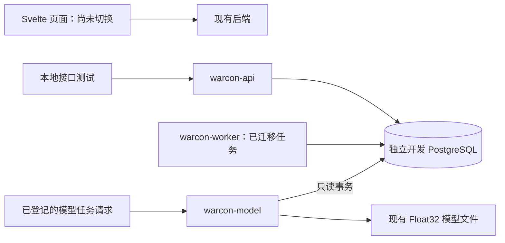

# Rust 后端迁移记录

目标：把 Warcon 的全部业务 API、SvelteKit 服务端页面中的业务查询与操作、后台任务迁移到 Rust。页面保留 Svelte 与 TypeScript。

## 当前状态

本次工作只在 `codex/rust-backend-refactor` 开发分支进行。没有部署 VPS，没有更改生产配置，没有向远程推送。

**这是迁移中的开发版本，不是已经完成的整套 Rust 后端。**
现有页面仍连接原来的后端，Rust 开发 API 默认监听 `127.0.0.1:4300`。
尚未迁移的路由返回 404，不能直接用这个服务替换生产 API。

完整接口与后台任务清单见 [rust-route-inventory.json](./rust-route-inventory.json)。
清单包括 147 个原有 HTTP 操作与 51 个页面服务端文件，并单独记录原生身份接口。
具体完成数量由 `backend/tools/update-inventory.ts` 从 Rust 路由注册表更新。
接口登记数量不替代行为验证；实际验证项目见下方和 `backend/tests`。

## 已迁移内容

| 部分 | 已实现的范围 |
| --- | --- |
| 数据库 | 使用现有 SQL 迁移并增加 0073 Passkey userHandle 兼容列；校验迁移哈希 |
| 身份与权限 | 密码、OTP、备用码、可信设备、Steam／Discord OAuth、Passkey、恢复密钥；原有账号兼容；权限和账号状态检查 |
| 密钥 | 兼容现有 AES-GCM 密文、API Key 格式；只保存密钥哈希，列表不返回明文 |
| 游戏通信 | RCON 40 个动作、优先级 dispatcher、配置文档与预留位回退、地址校验、DNS 固定、超时；避免不确定响应后的重复处罚 |
| 击杀接收 | 原始批次、去重、距离检查、双队列、独立有序消费者、租约确认、阵营前后名单核对 |
| API | 用户、组织、成员、邀请、服务器、授权、名单、个人插件、公开状态、排行榜、生涯；击杀、对局、备注、角色、密钥、Feed、自动化设置、分析和系统设置 |
| 名单同步 | 预留位增删与失败间隔、保留游戏服自有条目、过期撤销、导入与历史；已接轮询和封禁执行 |
| 五专家委员会 | 完整评估、地图／人数基线、个人历史、建案、人工审核、处罚和通知；七天封禁与确认违规一起提交 |
| Worker | 数据库租约、任务隔离、轮询与原始观察归档、玩家会话和换图；动作 relay、实时 SSE；Steam 档案、游戏时长、小时汇总 |
| 长窗模型 | expanded30m 与原有 27 通道原生 CPU 推理、各自特征构建、带鉴权 HTTP 服务 |
| 短窗模型 | 原生 IsolationForest／XGBoost 推理、只读采集、P99.6／P99.9、五窗加权、保护和动作审计；前端待适配 |
| 自动化 | 12 类触发器、名称过滤、数值／武器限制、禁止换边、死亡后强弱平衡、阵营人数配额、结构化与 AI 组队扫描、赛后奖项 |
| AI 与历史 | 完整压缩证据、严格 JSON、额度与缓存、自动分流、人工优先；JSON／JSONL 暂存审核、基线批准／撤销；分页保留任务 |
| QQ 与通知 | 原生 QQ 官方／OneBot、绑定、积分、地图投票、预留位兑换、订单；Discord 持久队列、状态卡片和通知 |
| 玩家与诊断 | 玩家档案、历史查询、Steam、生涯、敏感信息权限；服务器摘要、统计清理、Owner 诊断和令牌保护指标 |

## 服务结构

`warcon-worker` 与旧 Worker 使用相同数据库租约。因此同一个数据库已有 Worker 持有租约时，Rust Worker 拒绝启动。
任务领取、写回及完成确认必须持有当前租约；陈旧实例不能确认新实例领取的任务。

模型 HTTP 服务使用独立令牌；它本身不更新案件或处罚，不把异常分数当成作弊概率。
只有已经登记在数据库中的任务能够选择玩家和对局。客户端额外传入的玩家字段不改变读取范围。
同一时间最多一个推理；断开 HTTP 连接不会提前释放仍在 CPU 执行中的推理名额。

## 保留的数据语义

- 保留 180 秒 KPM、委员会投票、组织权限与密钥格式的既有规则。
- 阵营从新鲜且匹配地图的玩家名单获得，不退回滞后的 `player_sessions.faction`。
- 不可靠距离保留原始数据和无效标记，不作为可信百分位证据。
- Feed 原始批次、击杀、两个消费任务与活跃时间在事务中写入。
- 留存图继续使用相邻对局的留存人数与流失人数；名单缺失显示未知。
- Steam 未开放时长与真实零小时分开表示。
- 长窗特征按玩家、对局、时间排序，跨地图或服务器重启的混合序列拒绝拼接。
- 特征缺失使用掩码；不会把断流、缺少名单或缺少爆头标签当成零。
- 模型使用冻结的距离基线、武器类别与归一化参数；逐特征 Float32 舍入与原有实现一致。

## 本地验证

测试均在独立的本地 PostgreSQL 中运行，不连接生产服务器。

| 检查 | 内容 |
| --- | --- |
| 数据库合同测试 | 全部 SQL 迁移、权限范围、角色与密钥、事务、Feed 阵营与去重、任务租约 |
| 身份合同测试 | 原版密码／OTP／加密数据、完整登录与账号恢复、原生及旧版 Passkey、公钥验证和防重放 |
| 组织与服务器合同测试 | 权限、跨组织授权、最后管理员、并发邀请、密钥撤销、配额和 RCON 密码重填 |
| 动作与名单对照 | 40 个原版 RCON 动作；160 组同步计划、280 组错误分类、44 组封禁文本；真实本地 HTTP 同步 |
| 插件与公开 API | 101 组原版插件校验、个人数据隔离；240 组排行榜查询、公开开关、敏感字段脱敏和生涯聚合 |
| 委员会对照 | 从现有 TypeScript 生成的 156 个判断与投票样例 |
| Feed 对照 | 17 个协议解析样例 |
| 分析与规则对照 | 63 个数值限制、增长效率与时长分布样例 |
| 模型特征对照 | 9 组原有 Bun 实现结果：连续序列、去重、断流、缺失标签、跨地图、重启等 |
| 模型 HTTP 合同测试 | 鉴权、繁忙限制、JSON 与大小检查、已登记任务范围、名单脱敏、只读行为、完整响应 |
| 真实模型推理对照 | 本地 trained checkpoint 的两组输入；此前最大绝对分数误差小于 `1e-7` |

HTTP 合同测试使用零权重的合成测试文件验证服务流程，真实模型的数值一致性由独立 `model_fixture` 命令验证。两者不能互相替代。
CI 工作流只进行构建和合同测试，没有部署步骤。CI 尚未提交到远程运行。
开发命令、环境变量与测试步骤见 [backend/README.md](../backend/README.md)。

## 仍待迁移

1. 前端身份页面适配；OAuth 提供商的实际网络联调（本地签名和数据库流程已测试）。
2. 全部页面 load/actions 的业务逻辑及其前端数据适配。
3. 编译式插件目录与原生后台的最终集成验证。
4. 升级旧任务到双消费者的兼容演练、完整回归。
5. 实际外部 OAuth、QQ 和 AI 提供商网络联调；本地使用模拟服务，不冒充线上验证。
6. 短窗状态的前端读取适配，以及全部模型与案件／处罚链的最终回归。
7. 前端切换到 Rust API、Docker 开发编排、完整回归与升级演练。

完成这些项目并验证现有业务行为后，才能宣称全部后端迁移完成。生产部署属于后续单独操作，本开发分支不包含部署动作。
