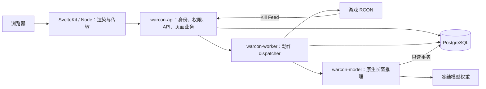

# Rust 后端迁移与验证记录

本分支把全部业务 API、页面 load/actions 的业务逻辑和后台任务迁到 Rust。SvelteKit 保留页面渲染、表单传输与二维码绘制，使用 Node.js 运行。业务请求统一进入 Rust，没有旧后端回退。

## 范围与运行结构

工作分支：`codex/rust-backend-refactor`。本次只修改本地开发代码，没有部署 VPS、修改生产配置或推送远程。

[接口清单](rust-route-inventory.json)登记原有 **147 个 HTTP 操作、51 个页面服务端入口**，另含身份接口及后台任务。接口数量只表示覆盖范围；权限、数据库事务、外部协议与数值结果由相应测试验证。

| 部分           | Rust 实现                                                                                                            |
| -------------- | -------------------------------------------------------------------------------------------------------------------- |
| 身份           | 密码、OTP、备用码、可信设备、Steam／Discord OAuth、Passkey、账号恢复、邀请与初次设置；保留原版凭据格式和登录限制     |
| 管理与公开 API | 用户、组织、角色、成员、邀请、服务器、授权、名单、插件、公开状态、排行榜、玩家档案、对局、分析、配置和诊断           |
| 页面业务       | 51 个 load 入口及原有全部具名 actions；Rust 独立校验每个页面权限，不依赖父 layout；原有 DTO 与日期传输适配           |
| 游戏通信       | 40 个 RCON 动作、dispatcher、Worker relay、配置与名单回退、DNS 固定、限流、轮询和权限校验 SSE                        |
| Feed 与风控    | 原始事件、去重、双消费者、阵营前后名单、独立有序消费、旧评分、五专家、个人历史、逐案件基线、重建与历史导入           |
| 案件与处罚     | 证据、审核、分页归档、七天封禁、动作队列、结果未知处理、通知与保留策略；保留现有保护和人工优先规则                   |
| 自动化         | 12 类触发器、名称过滤、数值／武器限制、禁止换边、死亡后强弱平衡、阵营人数配额、结构化／AI 组队扫描、赛后奖项与广播   |
| AI 与后台任务  | 完整压缩 JSON 证据、严格 JSON 输出、日额度、缓存、自动分流、长窗任务、Steam 档案／时长、汇总与保留                   |
| QQ 与通知      | 官方 QQ、OneBot、绑定、积分、投票、订单、举报、预留位；Discord／Webhook 持久队列、429 延后及状态卡片                 |
| 模型           | 原有 27 通道与 expanded30m 的 Float32 特征／推理；短窗 IsolationForest／XGBoost、60／120 秒输入、10 秒更新与前端状态 |
| 部署开发       | Rust 镜像、Node 渲染镜像、独立开发 Compose、原生迁移／恢复 CLI、旧数据库升级测试与 CI                                |

旧 `src/lib/server`、`src/worker` 和 Bun 模型源码保留为离线行为对照、测试与类型参考，不会被生产页面导入或启动。构建时可使用 Bun 安装前端依赖；业务服务运行不依赖 Bun 或 Python。

## 兼容与升级

- 沿用现有 `drizzle/` SQL 迁移历史及哈希，不重建生产表，不替换数据库卷。
- `0073` 增加旧 Passkey 的 userHandle 兼容列；`0074` 保留小数风险分；`0075` 增加通知输入和投递队列。
- 密码使用原版 scrypt 参数；OTP、签名 Cookie、API Key 和已有 RCON 密文兼容。旧环境的 `BETTER_AUTH_SECRET`、`ENCRYPTION_KEY` 必须保留。
- Worker 共用数据库租约。一个数据库只允许一个活动 Worker；陈旧实例不能确认新实例领取的任务。切换时先停止旧 Worker。
- 升级测试从 `0047` 之前的单消费者任务开始，应用完整迁移：保留原 Legacy 完成状态，只为有效历史建立 Integrity 工作，过旧事件不执行实时处罚，重复迁移不重复建任务。
- 不确定的外部动作不会盲目重发。面板隔离已经生效时，游戏踢出失败不会把隔离改成未生效。

## 数据与模型语义

KPM 按可靠的当前对局事件与匹配地图的新鲜名单计算；无法计算时保留未知或已确认下限。地图别名、武器、阵营、重启、双时钟及缺失标签处理与原实现对照。

长窗按玩家、对局和时间顺序构建；拒绝跨地图或重启拼接。冻结武器／距离基线、归一化参数、缺失掩码及逐特征 Float32 舍入保持一致。模型分数与参考百分位不被描述成已校准作弊概率。

短窗状态由 Rust 写入 `rust:shortRiskSnapshot`，风控页面已读取该状态。保持现有 P99.6 警惕、连续五窗 P99.9 与加权、人数、健康、VIP 和频率保护。关闭执行开关时仍可观察结果。

AI 输入使用完整相关证据的列／字典压缩 JSON；超出上限明确失败，不偷偷裁掉证据。人工审核优先，低风险副本清理不删除原始训练事件。公共页面不会泄露完整账号、QQ、令牌或 RCON 密码。

## 验证依据与边界

本地测试使用独立 PostgreSQL 数据库及本地模拟游戏服务，不连接生产服务器。

- 原有协议、身份、插件、分析、委员会、规则与自动化的 TypeScript 结果生成冻结对照；Rust 核对返回值与数值边界。
- PostgreSQL 测试覆盖权限、跨组织隔离、迁移、并发邀请／额度、队列领取／确认、Feed、基线、审核、处罚、通知和保留。
- 所有 51 个页面查询核对必需 DTO 字段；独立访问受限页面、绕过 layout、归档筛选均测试。
- 玩家 KPM／武器距离／金钱曲线与原页面来源逐项对照；浮点误差允许 `1e-12` 相对容差，计数和状态严格一致。
- 短窗两种真实树模型及原有 27 通道检查点与原实现对照；expanded30m 真实检查点另通过 `model_fixture` 校验。此前真实长窗评分最大绝对误差小于 `1e-7`。
- 构建后的 Node 页面与 Rust API／Worker／模型联调覆盖初始化、登录 Cookie、账号、OTP、自动化／风控／案件／QQ／插件／组织页面、SSE、退出及表单错误。
- 前端类型检查与生产构建通过；生产 bundle 检查未发现旧数据库、认证引擎或 Worker 初始化代码。

Docker 编排和两个镜像的构建／启动测试已写入 CI。本机当前没有可用的 Docker 引擎，因此**本地未执行容器镜像构建**。外部 Steam／Discord OAuth、真实 QQ 和 AI 提供商仍需用相应账号在独立环境联调；本地协议与模拟服务测试不能代替这些线上连接。CI 尚未推送运行。

运行、配置、升级与回归命令见 [Rust 开发指南](rust-development.zh-CN.md)。
